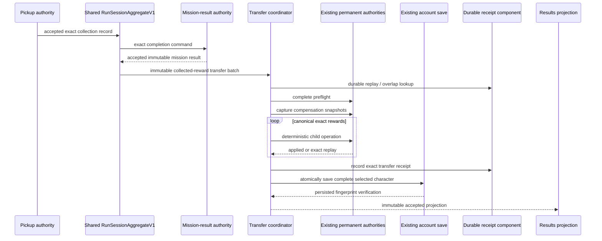

# DROP-PERSIST-PROOF-001 — Collected run rewards to permanent character state

## Status of this implementation iteration

Launch `main` SHA:

```text
777c3f93810d74184831af4753582b757fe12f69
```

Verified before implementation:

- `SAVE-ADAPTERS-001` / PR #260 is merged.
- `CHARACTER-COMPOSITION-001` / PR #263 is merged.
- `RUN-SESSION-001` / PR #270 is merged.
- `BOX-PERSIST-001` / PR #276 is merged.
- `PICKUP-LIVE-001` / PR #279 is still open and draft at this iteration.
- No merged PR already implements `DROP-PERSIST-PROOF-001`.

This first iteration intentionally adds only the isolated engine-neutral production
foundation that does not collide with PR #279. It does not add or run tests, and it
does not yet wire Results or the PR #279 journal into the production composition.

## Ownership boundary

The shared Run Session remains the authority for transient mission truth:

> this exact generated reward was physically collected in this exact run and
> lifecycle by this exact participant.

Permanent authorities remain the owners of account-backed truth:

- money wallet;
- scrap wallet;
- holdings and concrete equipment instances;
- unopened strongboxes and their deterministic opening contexts;
- durable account components.

`CollectedRunRewardTransferCoordinatorV1` owns no wallet, inventory, strongbox,
mission-result, character, Run Session, or save state. It coordinates an immutable
transfer batch through narrow ports, records a downstream receipt, and requires the
existing account save boundary to persist and verify the complete selected character.

The collected journal is never deleted or rewritten to simulate transfer. A durable
receipt records the downstream application keyed by exact transfer operation, run,
accepted mission result, selected character, and reward batch.

## Immutable transfer batch

`CollectedRunRewardTransferBatchV1` freezes:

- one stable transfer operation ID;
- one exact run ID and accepted lifecycle generation;
- one accepted mission-result ID, payload, and fingerprint;
- one selected character instance ID;
- the expected permanent character revision and fingerprint;
- every exact eligible collected reward projection;
- a deterministic order-independent canonical fingerprint.

Each `CollectedRunRewardTransferItemV1` preserves the PR #279 journal identity and
provenance fields:

- generated reward child / concrete reward instance ID;
- reward kind, content definition ID, and exact quantity;
- pickup, grant, DROP operation, terminal event, and triggering event IDs;
- run and source lifecycle context;
- source entity, placement, definition, and attributed participant;
- generated batch and generated child fingerprints;
- room, physical spawn position, spawn fingerprint, and available-pickup fingerprint;
- collector entity and participant;
- collection operation, order, authoritative tick, and collected-record fingerprint.

The batch sorts only by exact reward identity and reward fingerprint. Collection
order is retained inside each item but does not affect batch ordering. Therefore
reordering the input records does not change the canonical batch fingerprint.

The transfer layer never rerolls, regenerates, substitutes, or normalizes a reward
identity.

## Deterministic child identities

Every child operation and transaction ID is derived from:

```text
transfer batch fingerprint
+ target authority identity
+ exact reward instance ID
+ exact reward fingerprint
```

The save operation ID is derived from the complete transfer batch fingerprint.

These derivations make an exact retry address the same existing authority operation.
Conflicting reuse of a transfer operation ID with a different batch fingerprint is
rejected before mutation.

## Exactly-once and overlap rules

Application order is:

1. look for an already durable receipt by transfer operation;
2. reject conflicting operation reuse;
3. reject any reward identity already owned by a different durable receipt;
4. export and validate the exact current selected-character state;
5. require the expected character ID, revision, and fingerprint;
6. require an available durable persistence port;
7. preflight the complete batch and every target authority;
8. capture compensation for all affected existing authorities;
9. apply deterministic child operations;
10. record the immutable transfer receipt;
11. atomically persist and verify the complete selected character;
12. publish the accepted result.

An exact durable receipt returns `ExactReplay` without applying a child operation
again. A batch that overlaps only part of an already accepted receipt is rejected;
the coordinator never silently applies the remainder.

The durable receipt authority indexes both transfer operation IDs and exact reward
instance IDs. It is history/proof only and cannot mutate wallets or holdings.

## Compensation and atomic save

`ICollectedRunRewardTransferAuthorityPortV1` must capture the existing immutable
snapshots needed to restore all affected authorities, including the durable receipt
authority. The coordinator treats reward mutation, receipt recording, and account
persistence as one caller-visible transaction.

Any child rejection, exception, receipt rejection, save rejection, or verification
mismatch invokes restoration from the captured compensation.

- confirmed restoration returns a structured retryable rejection;
- failed restoration returns `FatalCompensationFailure`;
- the fatal result includes both the original failure and compensation diagnostic;
- the transfer is never marked complete after uncertain restoration.

`ICollectedRunRewardTransferPersistencePortV1.PersistAndVerify` is required to use
the existing selected-character/account save path. It must verify that the persisted
character contains the exact durable receipt before returning success. It may not
write a second account file or a transfer-only save protocol.

## Durable receipt component

`CollectedRunRewardTransferReceiptSaveComponentV1` provides an optional, explicit,
versioned character save component:

```text
save-component.collected-run-reward-transfer-receipts
collected-run-reward-transfer-receipts-explicit-v1
```

Its payload contains:

- receipt-authority revision;
- exact transfer operation and batch fingerprint;
- run, lifecycle, mission-result, and character identity;
- exact applied reward instance IDs;
- resulting permanent authority fingerprints;
- each receipt fingerprint.

The codec is explicit and deterministic. It stores no CLR type name and performs no
reflection. Snapshot construction rejects duplicate operation IDs and any reward
identity appearing in two receipts.

The component is optional for old characters. Once the production transfer adapter is
installed, new accepted transfers persist it through the existing additional
character-adapter composition seam.

## Crash and interruption states

| Observed state after reload | Meaning | Required behavior |
| --- | --- | --- |
| No receipt | Transfer was not durably accepted | Retry the exact batch |
| Receipt exists and matches | Transfer and save completed | Return exact replay |
| Same operation, different batch | Persisted conflict | Reject without mutation |
| Reward appears in another receipt | Partial or cross-operation overlap | Reject without mutation |
| Live mutation occurred but save did not verify | Not accepted | Restore and permit exact retry |
| Save succeeded before Results refreshed | Accepted | Reload receipt and show completed |

The accepted receipt, not an in-memory dictionary or Results-local flag, is the
permanent replay source of truth.

## Equipment and strongbox identity preservation

The authority adapter added after PR #279 merges must resolve the exact generated
reward payload by the journal's generated child identity and fingerprint.

For equipment it must pass the original concrete equipment instance, including its
definition, level, quality, augments, and generated data, to the existing reward and
holdings authorities. Equal equipment definitions remain distinct exact instances.
An existing identity with conflicting content rejects the complete batch.

For strongboxes it must preserve the original instance ID, tier/definition, grant and
source provenance, and deterministic opening context. Transfer registers the exact
box as unopened. It never opens or rerolls the box, and the existing BOX flow remains
the only opening/consumption authority.

Money and scrap use the exact collected quantities and deterministic child operation
IDs; quantities are never recalculated from drop profiles.

## Why UI and collision callbacks cannot grant permanent rewards

A collision callback proves only that a run-local pickup interaction occurred. It
cannot prove that mission completion was accepted, that the lifecycle is eligible,
that all collected records form one valid batch, that the selected permanent
character still matches the frozen run, or that an account save succeeded.

Results presentation likewise cannot infer eligibility from visible cards, kill
counts, local lists, or drop profiles. It may submit a typed retry command and display
the immutable transfer projection. It may not mutate wallets, holdings, strongboxes,
or transfer status.

## Sequence



## First-iteration changed-file boundary

Production changes are intentionally confined to:

```text
Assets/ShooterMover/Runtime/Application/Rewards/CollectedRunTransfers/**
Assets/ShooterMover/Runtime/Application/Persistence/Components/KnownSaveComponentVersionGuardV1.cs
docs/architecture/rewards/DROP_PERSIST_PROOF_V1.md
```

No PR #279 pickup/journal file, Results controller, scene bootstrap, Stage 1 controller,
wallet authority, holdings authority, strongbox authority, mission-result authority,
or save protocol is modified.

## Deferred integration and proof

After PR #279 merges, the next iteration must add:

- the exact `RunSessionCollectedRewardV1` to transfer-item adapter;
- generated reward payload resolution for equipment and strongboxes;
- the existing-authority port over money, scrap, holdings, BOX, receipt, and restore;
- the existing account-save persistence port;
- accepted mission completion and Results integration;
- engine-neutral, persistence, and production integration tests;
- Unity compilation, focused EditMode/PlayMode XML, and manual route proof.

No test or compilation success is claimed by this first iteration.
