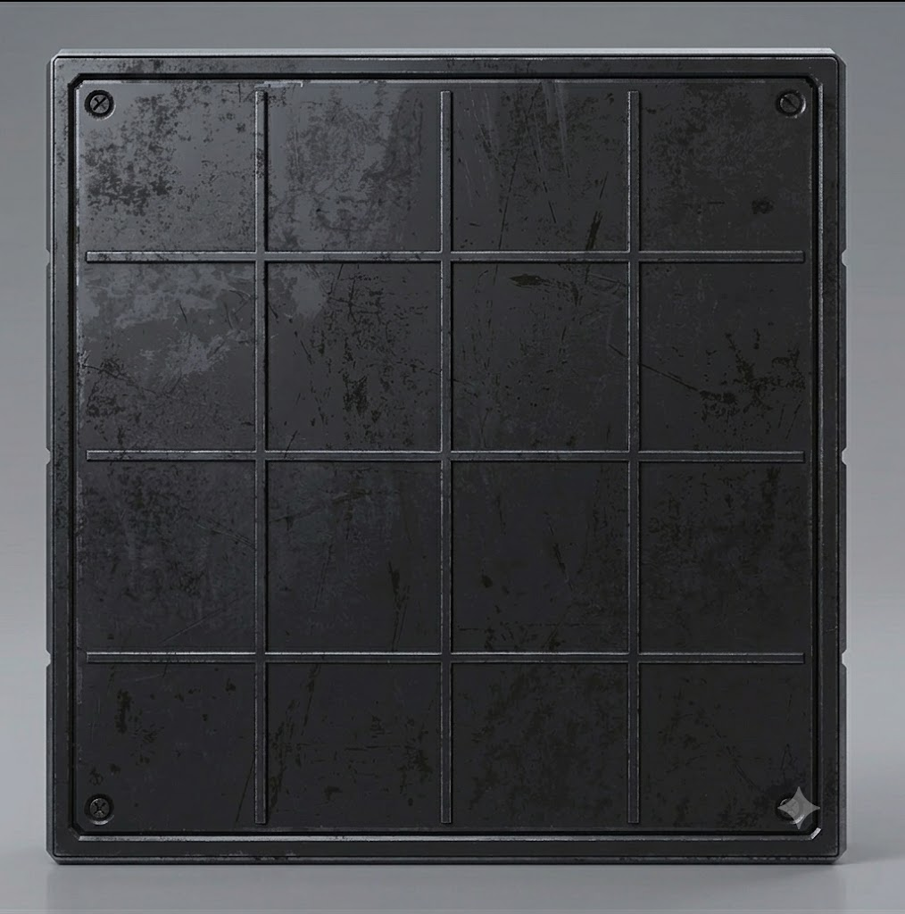
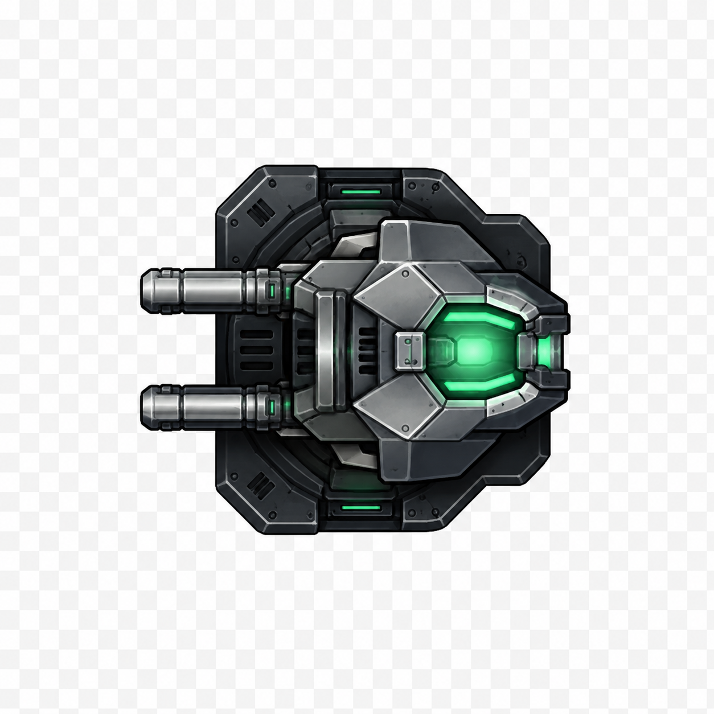
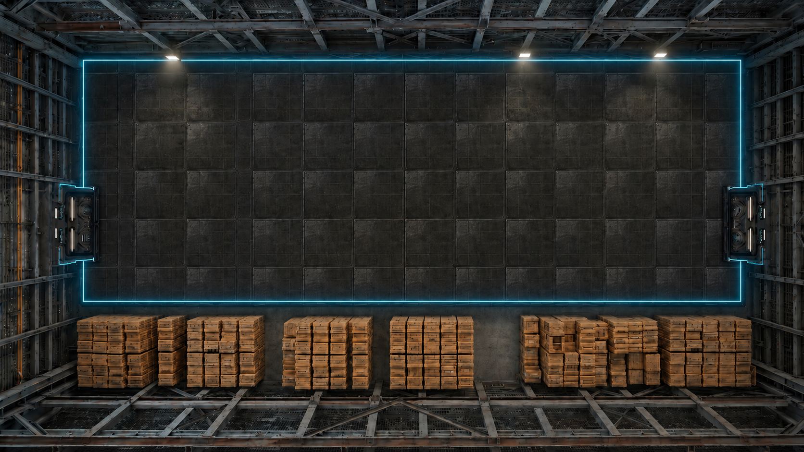
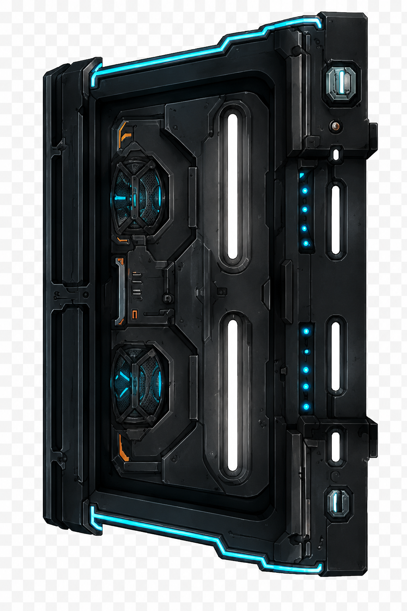
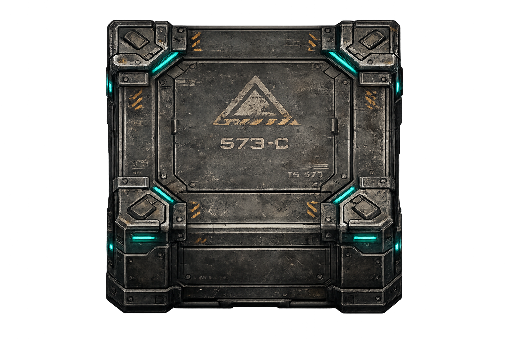
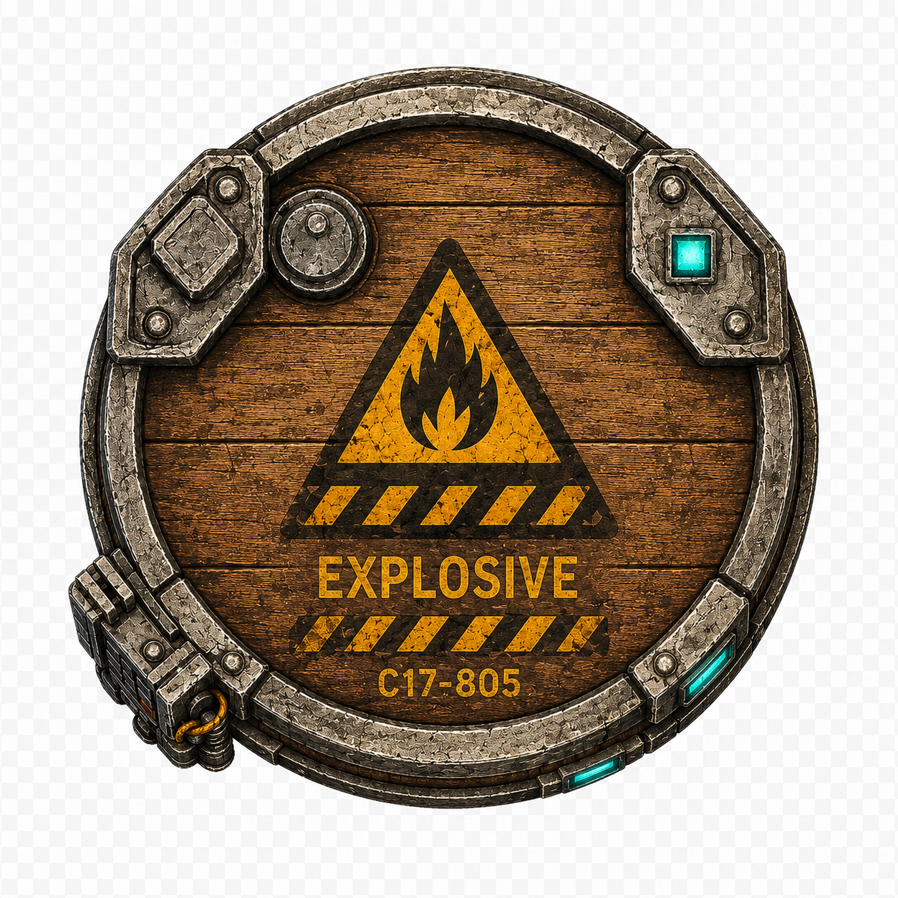

# Selected intake contact sheet

| Intended use | Preview | Intake decision |
| --- | --- | --- |
| Dark industrial floor |  | Accepted as a repeatable prototype floor sprite. |
| Weak standing turret |  | Accepted as an opaque presentation reference; baked checkerboard recorded. |
| Room composition |  | Accepted as a composition reference, not executable layout truth. |
| Door prop |  | Accepted as an opaque prop reference; baked checkerboard recorded. |
| Crate prop |  | Accepted with real transparency. |
| Explosive prop |  | Accepted as presentation only; baked checkerboard recorded. |

The inventory is intentionally small so VS-002 and VS-003 receive a coherent
visual vocabulary without turning VS-001 into a general asset dump.
